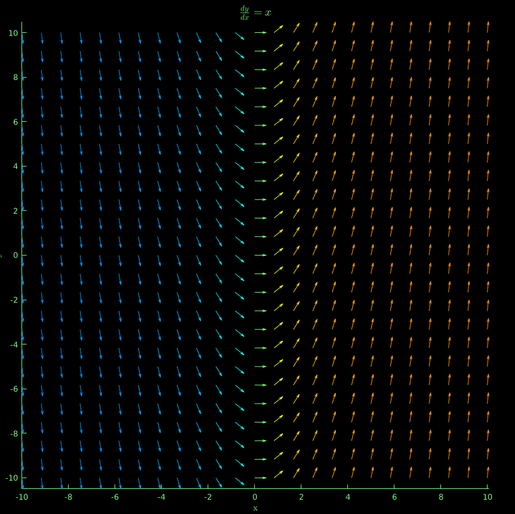
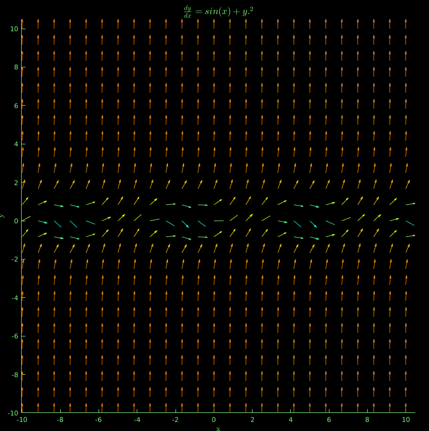
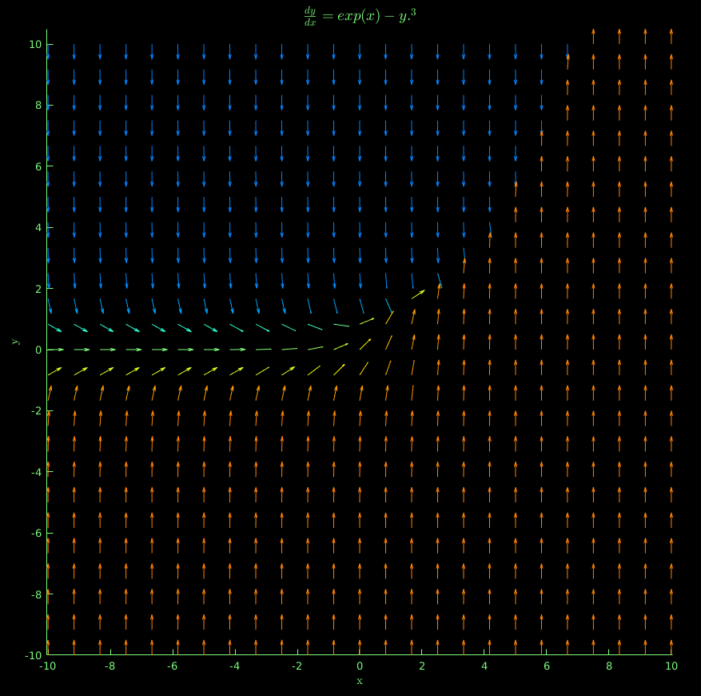

### Diffy Q Proof of concept

This repository contains functions that are used to visualize the directional field 
of ordinary differential equations.

To use the directional_field function, we first declare a differential function with two inputs:

```MATLAB
dydx = @(x, y) x + y;
```

We then graph the directional field with the following call:
```MATLAB
directional_field(dydx);
```


Even if the ODE has only one input, to make MATLAB happy we should still define our function handle with two inputs:

```MATLAB
dydx = @(x, y) x;
directional_field(dydx);
```




For a function involving squares, we should include the "element-wise" operator '.':

```MATLAB
dydx = @(x, y) sin(x) + y.^2;
directional_field(dydx);

```

